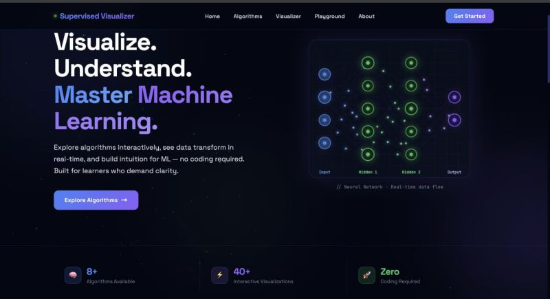
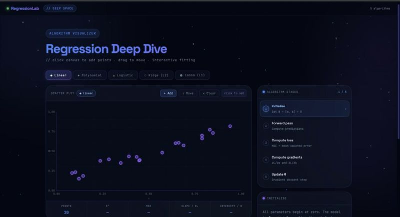
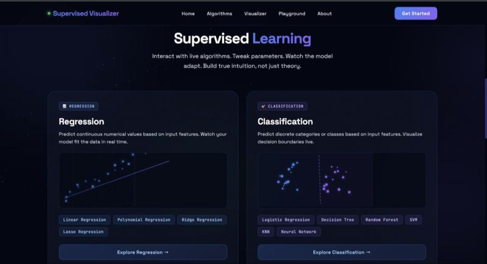
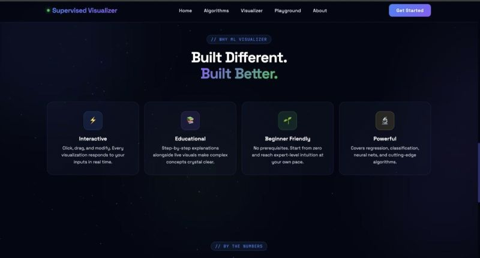

# 🤖 ML Visualizer

> Interactive Machine Learning Visualizer for Regression and Classification Algorithms with real-time animations and educational insights.

## 🌐 Live Demo

👉 [ML Visualizer — Live Demo](https://machinelearningvisualizer.netlify.app/)

Explore machine learning algorithms through interactive visualizations, animations, and step-by-step insights.

---

## ✨ Features

- 📊 Interactive Machine Learning Visualizations
- 📈 Regression Algorithm Visualization
- 🧠 Classification Algorithm Visualization
- ⚡ Real-time Animations
- 📚 Educational Algorithm Insights
- 🎯 Interactive Parameters
- 💻 Browser-based — no installation required

---

## 🧠 Algorithms

### Regression

- Linear Regression
- Regression visualization with interactive data points
- Prediction and error visualization

### Classification

- Classification algorithm visualization
- Interactive decision boundaries
- Step-by-step learning visualization

---

## 🛠️ Tech Stack

- HTML
- CSS
- JavaScript
- Machine Learning Concepts
- Interactive Data Visualization

---

## 📸 Screenshots

### 🏠 Dashboard



### 📈 Regression Visualizer



### 🧠 Supervised Learning



### ✨ Features



---


## 👨‍💻 Author

Made by Irshad Ali  
B.Tech CSE (AI & ML) | Web Dev & AI Automation Learner

GitHub: https://github.com/Irshadali1786

---

## 📌 License

MIT License

---


## 🚀 Getting Started

### Clone the Repository

```bash
git clone https://github.com/Irshadali1786/ML_Visualizer.git
cd ML_Visualizer


